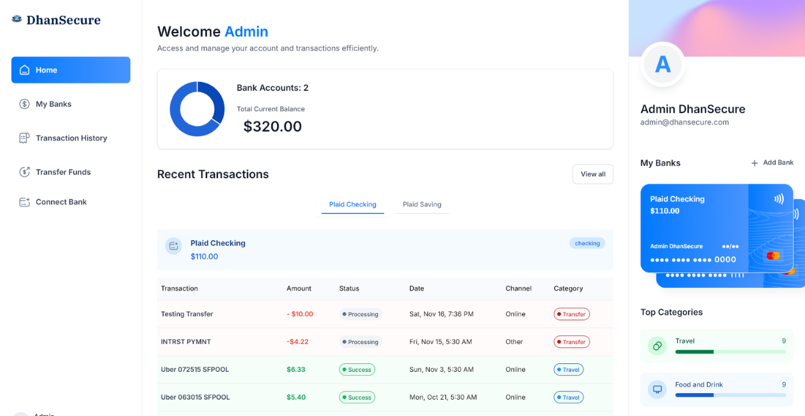

# DhanSecure 🏦

[](https://github.com/iOMJaiswal/DhanSecure/blob/main/LICENSE)
[](https://nextjs.org)
[](https://www.typescriptlang.org)
[](https://tailwindcss.com)

DhanSecure is a robust, enterprise-grade online banking platform that prioritizes security, performance, and user experience. Built with modern technologies, it offers a comprehensive solution for managing multiple bank accounts, tracking transactions, and analyzing financial data.



## ✨ Key Features

- 🏦 Connect multiple bank accounts
- 💸 Real-time transaction tracking
- 📊 Financial analytics and reporting
- 🔄 Easy fund transfers between accounts
- 🔒 Secure authentication system
- 📱 Responsive design for all devices

## 🛠️ Technology Stack

### Frontend
- **Next.js 13+** - React framework with server-side rendering
- **TypeScript** - Static type checking and enhanced IDE support
- **Tailwind CSS** - Utility-first CSS framework
- **shadcn/ui** - Reusable component system
- **Chart.js** - Interactive data visualization

### Backend & Services
- **Appwrite** - Backend infrastructure and authentication
- **Plaid** - Secure bank account integration
- **Dwolla** - Payment processing and transfers
- **Sentry** - Real-time error tracking and monitoring

## 🚀 Getting Started

### Prerequisites

```bash
Node.js >= 18.0.0
npm >= 8.0.0 or yarn >= 1.22.0
Git
```

### Development Setup

1. **Clone and Install**
   ```bash
   git clone https://github.com/iOMJaiswal/DhanSecure.git
   cd dhansecure
   npm install
   ```

2. **Configure Environment**
   ```bash
   cp .env.example .env
   ```
   
   Required environment variables:
   ```env
   # Application
   NEXT_PUBLIC_SITE_URL=http://localhost:3000
   NODE_ENV=development
   
   # Appwrite Configuration
   NEXT_PUBLIC_APPWRITE_ENDPOINT=your_endpoint
   NEXT_PUBLIC_APPWRITE_PROJECT=your_project_id
   APPWRITE_DATABASE_ID=your_database_id
   APPWRITE_USER_COLLECTION_ID=your_collection_id
   APPWRITE_BANK_COLLECTION_ID=your_collection_id
   APPWRITE_TRANSACTION_COLLECTION_ID=your_collection_id
   NEXT_APPWRITE_KEY=your_api_key
   
   # Plaid Integration
   PLAID_CLIENT_ID=your_client_id
   PLAID_SECRET=your_secret
   PLAID_ENV=sandbox
   PLAID_PRODUCTS=transactions,auth
   PLAID_COUNTRY_CODES=US,CA
   
   # Dwolla Configuration
   DWOLLA_KEY=your_key
   DWOLLA_SECRET=your_secret
   DWOLLA_BASE_URL=your_base_url
   DWOLLA_ENV=sandbox
   ```

3. **Start Development Server**
   ```bash
   npm run dev
   ```
   Access the application at `http://localhost:3000`

## 📁 Project Structure

```
dhansecure/
├── app/                    # Next.js app directory
├── components/             # React components
├── lib/                    # Utility functions and APIs
├── public/                # Static assets
└── types/                 # TypeScript type definitions
```

## Error Tracking

This project uses Sentry for error tracking. The configuration can be found in:

- sentry.client.config.ts


- sentry.edge.config.ts


- sentry.server.config.ts


## 🚢 Check Demo

### Website Link
- `https://dhansecure.vercel.app/`

### Testing Credentials
Login Credentials : 
- Email : admin@dhansecure.com
- Password: Pass@1234

Plaid Dummy Credentials :
- Email : user_good
- Password: pass_good


## 🤝 Contributing

We welcome contributions!

1. Fork the repository
2. Create your feature branch: `git checkout -b feature/amazing-feature`
3. Commit your changes: `git commit -m 'Add amazing feature'`
4. Push to the branch: `git push origin feature/amazing-feature`
5. Open a Pull Request

## 📄 License

This project is licensed under the MIT License - see the [LICENSE](LICENSE) file for details.

## 🙏 Credits

- UI Components: [shadcn/ui](https://ui.shadcn.com/)
- Icons: [Lucide Icons](https://lucide.dev/)

## 💬 Support
- Email: iomjaiswal02@gmail.com
